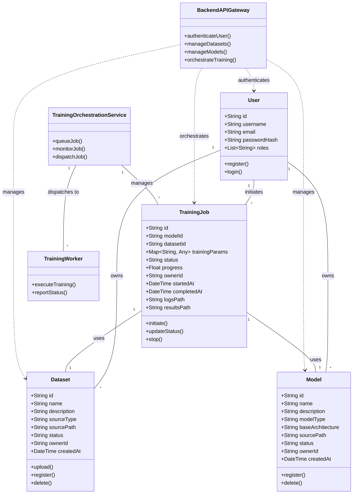
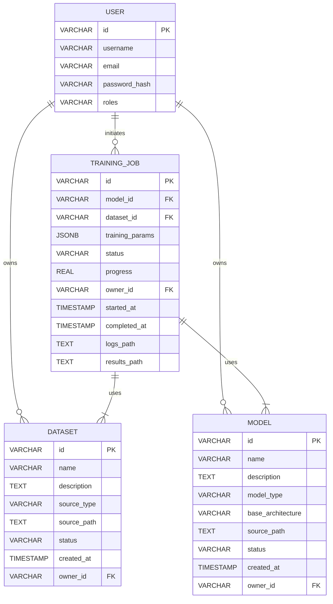

ARCHITECTURE DIAGRAM

```
@startuml
skinparam backgroundColor #FFFFFF
skinparam rectangle {
    BorderColor #2C3E50
    BackgroundColor #F8F9FA
    RoundCorner 15
}
skinparam package {
    BorderColor #2C3E50
    BackgroundColor #FFFFFF
    FontStyle bold
}
skinparam arrow {
    Color #4A90E2
    Thickness 2
}

title QLoRA Orchestration Service - Architecture Diagram

actor "**User**\nA user who interacts with the QLoRA Orchestration Service to manage datasets, models, and training jobs." as USER #FFDD99

package "Frontend Layer" {
    rectangle "**Frontend UI**\nThe web-based interface for interacting with the QLoRA Orchestration Service.\nBuilt with Next.js, Tailwind CSS, Shadcn/ui, Aceternity UI, TypeScript." as FRONTEND #CCE5FF
}

package "Backend API Layer" {
    rectangle "**Backend API Gateway**\nCentral entry point for all API requests, routing them to appropriate microservices.\nBuilt with FastAPI." as API #D6EAF8
    rectangle "**Authentication Service**\nHandles user registration, login, and token management.\nBuilt with FastAPI." as AUTH #E6F4EA
}

package "Processing Layer" {
    rectangle "**Training Orchestration Service**\nManages lifecycle of training jobs: queuing, scheduling, monitoring.\nBuilt with FastAPI, Celery/RabbitMQ." as TOS #FFF3CD
    rectangle "**Training Workers / Containers**\nExecutes actual QLoRA fine-tuning.\nRuns on Jetson Nano emulators or VMs.\nUses Python, PyTorch, bitsandbytes, PEFT." as WORKER #E8DAEF
}

package "Storage & Monitoring Layer" {
    rectangle "**Database Service**\nPersistent storage for users, datasets, models, training jobs.\nPostgreSQL." as DB #FDEDEC
    rectangle "**Model/Dataset Storage**\nStores raw datasets, pre-trained models, fine-tuned QLoRA adapter weights.\nS3-compatible object storage." as STORAGE #D4EFDF
    rectangle "**Monitoring/Logging Service**\nAggregates logs and metrics from services and workers.\nPrometheus/Grafana, ELK Stack." as MONITOR #FAE5D3
}

' Connections
USER -[#4A90E2]-> FRONTEND : Uses (HTTPS)
FRONTEND -[#4A90E2]-> API : API Calls (HTTPS)
API -[#4A90E2]-> AUTH : Authenticates Users
API -[#4A90E2]-> DB : Manages Data
API -[#4A90E2]-> TOS : Initiates/Queries Jobs
TOS -[#4A90E2]-> DB : Manages Job Records
TOS -[#4A90E2]-> WORKER : Dispatches/Monitors Training Tasks
WORKER -[#4A90E2]-> STORAGE : Accesses/Stores Models & Datasets
WORKER -[#4A90E2]-> MONITOR : Sends Logs & Metrics
DB -[#4A90E2]-> STORAGE : Stores Metadata
MONITOR -[#4A90E2]-> FRONTEND : Provides Dashboards (Indirectly)

@enduml
```

CLASS DIAGAM



ER DIAGRAM



ACTIVITY DIAGRAM

```
@startuml
skinparam activity {
    BackgroundColor #ECF5FF
    BorderColor #2C3E50
    ArrowColor #4A90E2
}

start
:User clicks "Initiate Training";
:Frontend collects parameters;
:POST /trainings to API Gateway;
if (Token valid?) then (yes)
    :Forward to Orchestration Service;
    :Create DB record (queued);
    :Add to Job Queue;
    :Return 202 Accepted;
else (no)
    :Return 401 Unauthorized;
    stop
endif

repeat
    :Frontend polls GET /trainings/{id};
    :Query DB for status;
    if (Job running?) then (yes)
        :Update progress in UI;
    else (no)
        break
    endif
repeat while (status != completed/failed)

:Worker dequeues job;
:Update DB to running;
:Execute QLoRA fine-tuning;
:Store results in storage;
:Update DB to completed/failed;
:Return final status to user;

stop
@enduml
```
