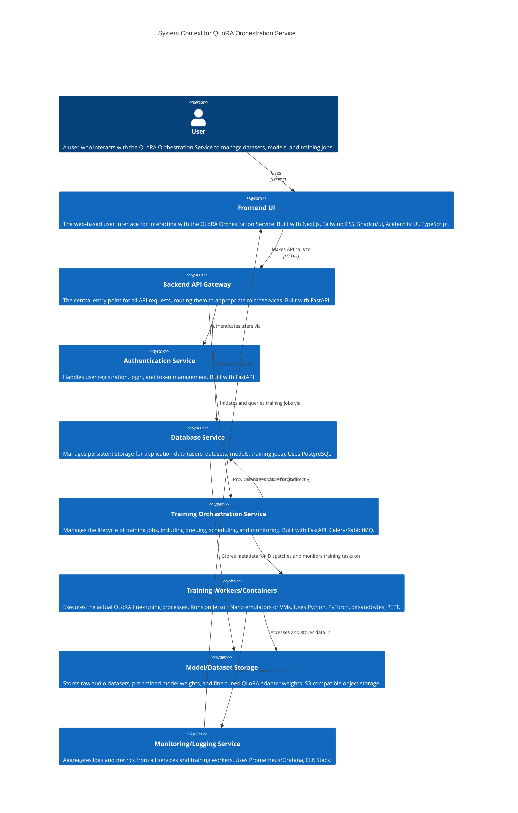
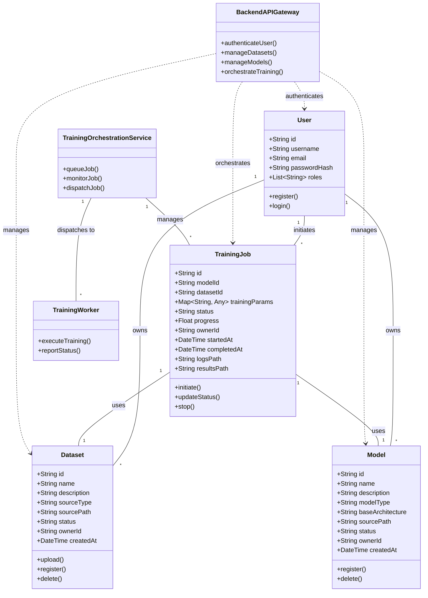
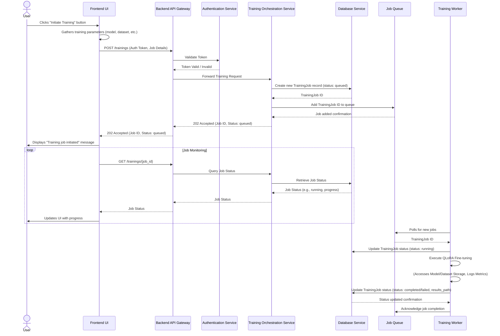
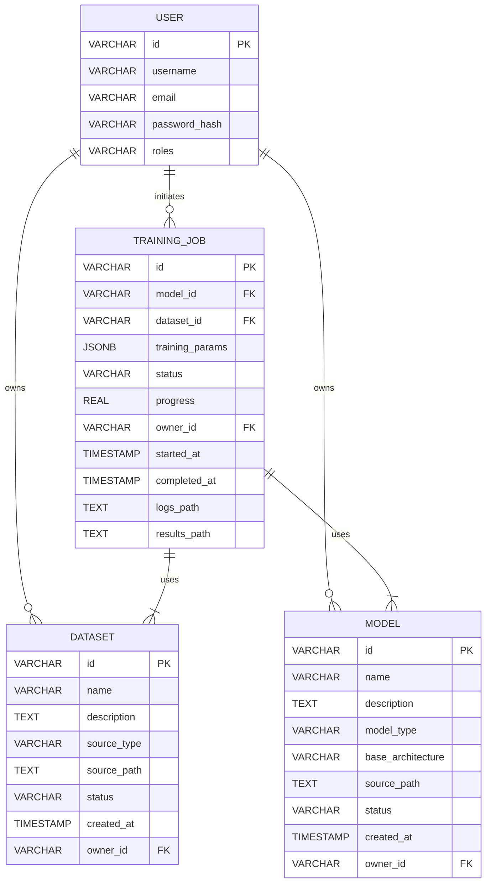

# Software Oriented Document: QLoRA Orchestration Service

## 1. Introduction
This document provides a comprehensive overview of the software architecture, design, and implementation considerations for the QLoRA Orchestration Service. It covers the System Requirements Specification (SRS), System Design Specification (SDS), and conceptual implementation diagrams, aiming to provide an industry-grade blueprint for development.

## 2. System Requirements Specification (SRS)

### 2.1. Functional Requirements

#### FR1: User Management
-   FR1.1: The system shall allow users to register with a unique username, email, and password.
-   FR1.2: The system shall allow registered users to log in using their credentials.
-   FR1.3: The system shall authenticate users and issue secure access tokens (JWT).

#### FR2: Dataset Management
-   FR2.1: The system shall allow authenticated users to upload new audio datasets.
-   FR2.2: The system shall allow authenticated users to register datasets via URL or cloud storage paths.
-   FR2.3: The system shall list all datasets accessible by the user.
-   FR2.4: The system shall allow users to view detailed information about a specific dataset.
-   FR2.5: The system shall allow users to delete their datasets.

#### FR3: Model Management
-   FR3.1: The system shall allow authenticated users to register new QLoRA-compatible audio models.
-   FR3.2: The system shall list all registered models accessible by the user.
-   FR3.3: The system shall allow users to view detailed information about a specific model.
-   FR3.4: The system shall allow users to delete their registered models.

#### FR4: Training Orchestration
-   FR4.1: The system shall allow authenticated users to initiate a new QLoRA fine-tuning job by selecting a registered model and dataset.
-   FR4.2: The system shall allow users to specify QLoRA-specific parameters (e.g., rank, alpha, dropout) and training parameters (e.g., epochs, learning rate, batch size).
-   FR4.3: The system shall provide real-time status updates for ongoing training jobs.
-   FR4.4: The system shall allow users to view logs and metrics for completed or ongoing training jobs.
-   FR4.5: The system shall allow users to stop an active training job.
-   FR4.6: The system shall provide an API endpoint for retrieving the fine-tuned model weights or an inference endpoint upon job completion.

#### FR5: Monitoring and Logging
-   FR5.1: The system shall log all significant events, including user actions, training job status changes, and errors.
-   FR5.2: The system shall provide mechanisms to view training progress and resource utilization.

### 2.2. Non-Functional Requirements

#### NFR1: Performance
-   NFR1.1: The API response time for authentication and management operations shall be under 500ms for 95% of requests.
-   NFR1.2: Training job initiation shall be acknowledged within 2 seconds.
-   NFR1.3: The system shall efficiently manage GPU memory during training processes, leveraging QLoRA's benefits.

#### NFR2: Security
-   NFR2.1: User passwords shall be securely hashed and stored.
-   NFR2.2: All API communication shall be secured using HTTPS.
-   NFR2.3: Access to resources shall be restricted based on user authentication and authorization.

#### NFR3: Scalability
-   NFR3.1: The system shall be designed to scale horizontally to accommodate an increasing number of concurrent users and training jobs.
-   NFR3.2: The training backend shall support distributed training environments (conceptual, for future).

#### NFR4: Usability
-   NFR4.1: The frontend UI shall be intuitive and easy to navigate for users with varying technical expertise.
-   NFR4.2: The UI shall provide clear feedback on user actions and system status.

#### NFR5: Maintainability
-   NFR5.1: The codebase shall be modular, well-documented, and adhere to established coding standards.
-   NFR5.2: Dependencies shall be managed effectively to facilitate updates and reduce conflicts.

#### NFR6: Reliability
-   NFR6.1: The system shall handle errors gracefully and provide informative messages.
-   NFR6.2: Training jobs shall be resilient to transient failures and support retry mechanisms where appropriate.

## 3. System Design Specification (SDS)

### 3.1. Architectural Overview
The QLoRA Orchestration Service will adopt a microservices-oriented architecture, separating concerns into distinct, independently deployable services. This design promotes scalability, fault isolation, and technology flexibility. The primary components include a Frontend UI, a Backend API Gateway, and a Training Orchestration Service.



### 3.2. Component Breakdown

#### 3.2.1. Frontend UI
-   **Technology Stack:** Next.js, Tailwind CSS, Shadcn/ui, Aceternity UI, TypeScript.
-   **Responsibilities:** User interface rendering, user interaction handling, API request initiation, client-side validation.

#### 3.2.2. Backend API Gateway
-   **Technology Stack:** FastAPI (Python).
-   **Responsibilities:** Exposing RESTful API endpoints, request routing, input validation, authentication/authorization enforcement, communication with backend services.

#### 3.2.3. Authentication Service
-   **Technology Stack:** FastAPI (Python), PostgreSQL/MongoDB (for user data).
-   **Responsibilities:** User registration, login, token generation (JWT), password hashing.

#### 3.2.4. Database Service
-   **Technology Stack:** PostgreSQL (for structured data like user profiles, dataset metadata, model metadata, training job records).
-   **Responsibilities:** Persistent storage and retrieval of application data.

#### 3.2.5. Training Orchestration Service
-   **Technology Stack:** FastAPI (Python), Celery/RabbitMQ (for job queueing), Docker/Kubernetes (for container orchestration).
-   **Responsibilities:** Receiving training requests, queuing jobs, provisioning and managing training workers (e.g., on Jetson Nano emulators or VMs), monitoring job progress, collecting results.

#### 3.2.6. Training Workers/Containers
-   **Technology Stack:** Python, PyTorch, `bitsandbytes`, `peft`, specific video-text model libraries.
-   **Responsibilities:** Executing the actual QLoRA fine-tuning process on provisioned hardware (e.g., NVIDIA Jetson Nano container emulator), accessing datasets and models, logging metrics.

#### 3.2.7. Model/Dataset Storage
-   **Technology Stack:** S3-compatible object storage (e.g., MinIO, AWS S3) or shared network file system.
-   **Responsibilities:** Storing raw video datasets, pre-trained model weights, and fine-tuned QLoRA adapter weights.

#### 3.2.8. Monitoring/Logging Service
-   **Technology Stack:** Prometheus/Grafana (for metrics), ELK Stack (Elasticsearch, Logstash, Kibana) or Loki/Promtail (for logs).
-   **Responsibilities:** Aggregating logs and metrics from all services and training workers, providing dashboards for system health and training progress.

### 3.3. Data Flow (Example: Initiating a Training Job)

1.  User interacts with Frontend UI to configure a new training job.
2.  Frontend sends a `POST /trainings` request to the Backend API Gateway.
3.  API Gateway validates the request, authenticates the user, and forwards it to the Training Orchestration Service.
4.  Training Orchestration Service validates input, creates a new job record in the Database Service, and adds the job to the Job Queue.
5.  A free Training Worker picks up the job from the Job Queue.
6.  Training Worker pulls the specified dataset and model from Model/Dataset Storage.
7.  Training Worker executes the QLoRA fine-tuning process.
8.  During training, the worker sends progress updates and logs to the Monitoring/Logging Service.
9.  Upon completion, the worker saves the fine-tuned QLoRA adapters to Model/Dataset Storage and updates the job status in the Database Service.
10. Frontend UI periodically polls the API Gateway (`GET /trainings/{job_id}`) to update the user on job status and progress.

## 4. Module Design and Implementation (Conceptual)

### 4.1. User Module
-   **Entities:** User (username, email, hashed_password, roles).
-   **API Endpoints:** `/auth/login`, `/auth/signup`, `/users/me`.
-   **Key Logic:** Password hashing (Bcrypt), JWT generation and validation.

### 4.2. Dataset Module
-   **Entities:** Dataset (id, name, description, source_type, source_path, status, owner_id).
-   **API Endpoints:** `/datasets`, `/datasets/{id}`.
-   **Key Logic:** File upload handling, metadata storage, status tracking (e.g., `processing`, `ready`, `error`).

### 4.3. Model Module
-   **Entities:** Model (id, name, description, model_type, base_architecture, source_path, status, owner_id).
-   **API Endpoints:** `/models`, `/models/{id}`.
-   **Key Logic:** Model registration, metadata storage.

### 4.4. Training Module
-   **Entities:** TrainingJob (id, model_id, dataset_id, params, status, progress, owner_id, logs_path, results_path).
-   **API Endpoints:** `/trainings`, `/trainings/{id}`, `/trainings/{id}/stop`.
-   **Key Logic:** Job queuing, worker assignment, status updates, result storage.

### 4.5. Core QLoRA Fine-tuning Logic (within Training Worker)
-   **Components:**
    -   `model_loader.py`: Loads base audio-text models.
    -   `qlora_injector.py`: Applies 4-bit quantization and injects LoRA adapters.
    -   `data_processor.py`: Handles audio signal processing, text tokenization, and batching.
    -   `trainer.py`: Implements the fine-tuning loop, including optimizer, loss function, and metric calculation.
    -   `temporal_aware_lora.py` (Advanced): Custom LoRA modules for temporal dynamics in audio.
    -   `cross_modal_rank_allocator.py` (Advanced): Logic for dynamic rank assignment.

## 5. UML Diagrams

### 5.1. Use Case Diagram
```mermaid
UMLet
Actor(User)
UseCase(Register User)
UseCase(Login)
UseCase(Manage Datasets)
UseCase(Manage Models)
UseCase(Initiate Training Job)
UseCase(Monitor Training Job)
UseCase(Stop Training Job)

User -- (Register User)
User -- (Login)
User -- (Manage Datasets)
User -- (Manage Models)
User -- (Initiate Training Job)
User -- (Monitor Training Job)
User -- (Stop Training Job)

(Manage Datasets) <. (Add Dataset) : <<include>>
(Manage Datasets) <. (View Dataset Details) : <<include>>
(Manage Datasets) <. (Delete Dataset) : <<include>>

(Manage Models) <. (Add Model) : <<include>>
(Manage Models) <. (View Model Details) : <<include>>
(Manage Models) <. (Delete Model) : <<include>>

(Initiate Training Job) <. (Select Dataset) : <<include>>
(Initiate Training Job) <. (Select Model) : <<include>>
(Initiate Training Job) <. (Configure Training Parameters) : <<include>>

```

### 5.2. Class Diagram


### 5.3. Sequence Diagram: Initiate Training Job


### 5.4. Entity-Relationship (ER) Diagram


### 5.5. Use Case Diagram (Improved)
```mermaid
UMLet
Actor(User)

UseCase(Register Account)
UseCase(Login to System)
UseCase(Manage Datasets)
UseCase(Manage Models)
UseCase(Initiate Training)
UseCase(Monitor Training Progress)
UseCase(Stop Training)

User -- (Register Account)
User -- (Login to System)
User -- (Manage Datasets)
User -- (Manage Models)
User -- (Initiate Training)
User -- (Monitor Training Progress)
User -- (Stop Training)

(Manage Datasets) <. (Add Dataset) : <<include>>
(Manage Datasets) <. (View Dataset Details) : <<include>>
(Manage Datasets) <. (Delete Dataset) : <<include>>

(Manage Models) <. (Add Model) : <<include>>
(Manage Models) <. (View Model Details) : <<include>>
(Manage Models) <. (Delete Model) : <<include>>

(Initiate Training) <. (Select Dataset) : <<include>>
(Initiate Training) <. (Select Model) : <<include>>
(Initiate Training) <. (Configure Training Parameters) : <<include>>

```

## 6. Conclusion
This document provides a foundational software specification for the QLoRA Orchestration Service, detailing its requirements, architectural design, and key modules. By adhering to these specifications, the development team can build a robust, scalable, and maintainable system capable of efficiently managing and orchestrating QLoRA fine-tuning processes for audio-text models.